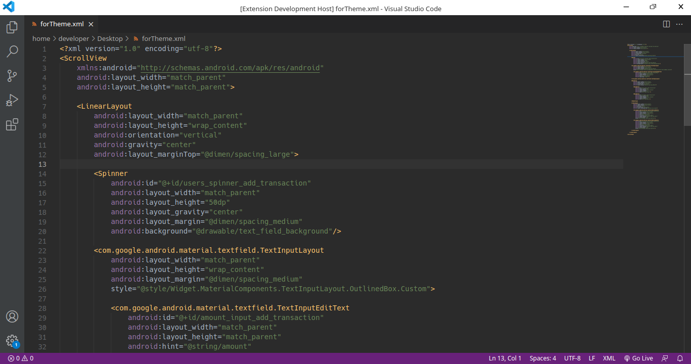
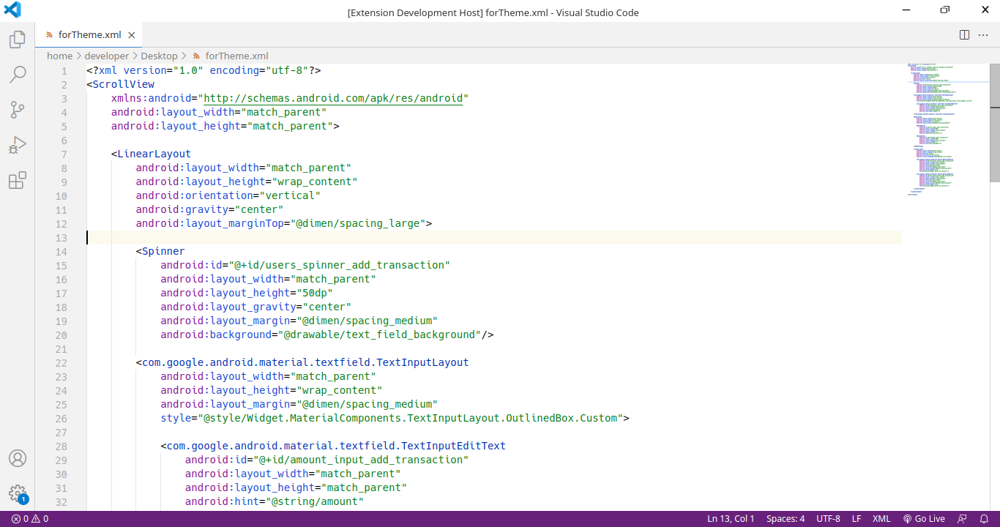

# Android Studio Default themes

Android Studio color theme contains two basic themes, Darcula and Intellij light.

#### [GitHub Repository](https://github.com/DevShayan/idx-color-theme)&nbsp;&nbsp;|&nbsp;&nbsp;[Report an issue](https://github.com/DevShayan/idx-color-theme/issues)

## Applying theme

### To apply theme:
* Ctrl+Shift+P -> Preferences: Color Theme -> Monospace Light (Project IDX)
* Ctrl+Shift+P -> Preferences: Color Theme -> Monospace Dark (Project IDX)

## Preview

* Monospace Light

<!--  -->
error

* Monospace Dark
error

<!--  -->

**Enjoy!**
